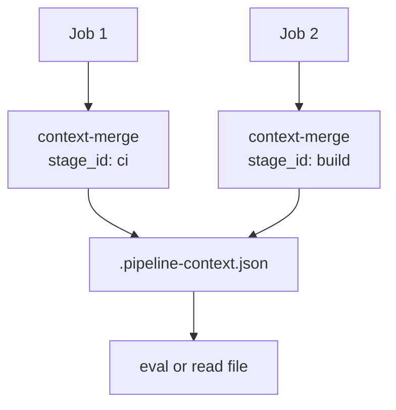

# pipeline-compose-context-merge

**Append stage results to a JSON file** — for custom workflows that don’t use [pipeline-compose-run](https://github.com/aeswibon/pipeline-compose-run).

Advanced / optional. Most teams should use **run + export** instead.

Part of [pipeline-compose](https://github.com/aeswibon/pipeline-compose).

---

## Do I need this?

**Yes, if** you’re building **one big workflow** (or a few jobs) and want a shared JSON file shaped like pipeline **`context`**, without the run orchestrator.

**No, if** you use **pipeline-compose-run** — it builds **`context`** for you from **export** artifacts. Adding merge steps would duplicate that.

---

## How it works



This is **local to one workflow run**. It does **not** replace **export** artifacts for **run**.

---

## Quick start

```yaml
- name: Tests
  id: ci
  run: echo "passed=true" >> "$GITHUB_OUTPUT"

- uses: aeswibon/pipeline-compose-context-merge@v1.17.0
  with:
    context_file: .pipeline-context.json
    stage_id: ci
    outputs: ${{ toJson(steps.ci.outputs) }}

- uses: aeswibon/pipeline-compose-context-merge@v1.17.0
  with:
    context_file: .pipeline-context.json
    stage_id: release
    outputs: '{"version":"1.2.3"}'
```

Example: [context-merge-manual](https://github.com/aeswibon/pipeline-compose/tree/master/examples/context-merge-manual).

<!-- start usage -->
```yaml
- uses: aeswibon/pipeline-compose-context-merge@v1.17.0
  with:
    context_file: .pipeline-context.json
    stage_id: ci
    outputs: '{"passed":"true"}'
```
<!-- end usage -->

---

## Glossary

| Term | Plain English |
|------|----------------|
| **`context_file`** | Path to JSON on the runner. Created if missing. |
| **`stage_id`** | Key name in the file (same naming as pipeline stage **`id`**). |
| **`outputs`** | JSON object merged at **`[stage_id]`** in the file. |
| **`context` (run)** | Built by **run** across **separate workflow dispatches**. Merge is **one workflow only**. |
| **Export artifact** | **`pipeline-compose-<id>`** for **run**. Merge does **not** create this. |

| | **context-merge** | **export + run** |
|---|-------------------|------------------|
| Scope | Single workflow run | Multiple dispatched workflows |
| Storage | File on disk | GitHub artifact |
| Use with run? | No (different path) | Yes (standard path) |

---

## Common questions

**Can I use merge instead of export?**  
Not with **pipeline-compose-run**. Run only reads **export** artifacts.

**Why use the same `stage_id` names as the pipeline?**  
So **`context.ci.passed`** in **eval** or docs matches pipeline conventions.

**File persists between workflow runs?**  
No — only within this run unless you commit/upload it yourself.

---

## Inputs

| Input | Required | Default | Description |
|-------|----------|---------|-------------|
| `context_file` | yes | `pipeline-context.json` | JSON file path |
| `stage_id` | yes | — | Key under root object |
| `outputs` | yes | — | JSON object to merge |

---

## Related actions

| Action | Role |
|--------|------|
| [pipeline-compose-run](https://github.com/aeswibon/pipeline-compose-run) | Standard orchestration + **context** |
| [pipeline-compose-export](https://github.com/aeswibon/pipeline-compose-export) | Artifact for **run** |
| [pipeline-compose-eval](https://github.com/aeswibon/pipeline-compose-eval) | Evaluate expressions against merged JSON |

## License

[MIT](LICENSE)
